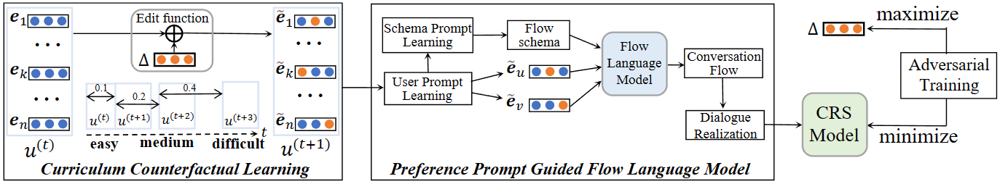

# CFCRS

This is the official PyTorch implementation for the paper:

> Xiaolei Wang, Kun Zhou, Xinyu Tang, Xin Zhao, Fan Pan, Zhao Cao, Ji-Rong Wen. Improving Conversational Recommendation Systems via Counterfactual Data Simulation. KDD 2023.

## Overview

Conversational recommender systems (CRSs) aim to provide recommendation services via natural language conversations. Although a number of approaches have been proposed for developing capable CRSs, they typically rely on sufficient training data for training. Since it is difficult to annotate recommendation-oriented dialogue datasets, existing CRS approaches often suffer from the issue of insufficient training due to the scarcity of training data.

To address this issue, in this paper, we propose a CounterFactual data simulation approach for CRS, named **CFCRS**, to alleviate the issue of data scarcity in CRSs. Our approach is developed based on the framework of counterfactual data augmentation, which gradu-ally incorporates the rewriting to the user preference from a real dialogue without interfering with the entire conversation flow. To develop our approach, we characterize user preference and organize the conversation flow by the entities involved in the dialogue, and design a multi-stage recommendation dialogue simulator based on a conversation flow language model. Under the guidance of the learned user preference and dialogue schema, the flow language model can produce reasonable, coherent conversation flows, which can be further realized into complete dialogues. Based on the sim-ulator, we perform the intervention at the representations of the interacted entities of target users, and design an adversarial training method with a curriculum schedule that can gradually optimize the data augmentation strategy.



## Requirements

- python == 3.8
- pytorch == 1.8.1
- cudatoolkit == 11.1.1
- transformers == 4.21.3
- pyg == 2.0.1
- accelerate == 0.12
- nltk == 3.6

You can also see ``requirements.txt``.

We only list the version of key packages here. 

## Quick-Start

We run all experiments and tune hyperparameters on a GPU with 24GB memory, you can adjust `per_device_train_batch_size` and `per_device_eval_batch_size` in the script according to your GPU, and then the optimization hyperparameters (e.g., `learning_rate`) may also need to be tuned.

The number after each command is used to set ``CUDA_VISIBLE_DEVICES``.

You can change ``save_dir_prefix`` in the script to set your own saving directory.

### Training Recommendation Dialogue Simulator

- dataset: [redial, inspired]

```bash
bash script/simualtor/{dataset}/train_FLM.sh 0
bash script/simualtor/{dataset}/train_schema.sh 0
```

### Training CRS models

- model: [KBRD, BARCOR, UniCRS]
- dataset: [redial, inspired]

```bash
bash script/{model}/{dataset}/train_pre.sh 0  # only for UniCRS
bash script/{model}/{dataset}/train_rec.sh 0
bash script/{model}/{dataset}/train_cf.sh 0
bash script/{model}/{dataset}/train_conv.sh 0
```

## Contact

If you have any questions for our paper or codes, please send an email to wxl1999@foxmail.com.

[//]: # (## Acknowledgement)

[//]: # ()
[//]: # (Please cite the following papers as the references if you use our codes or the processed datasets.)

[//]: # ()
[//]: # (```bibtex)

[//]: # (@inproceedings{wang2022towards,)

[//]: # (  title={Towards Unified Conversational Recommender Systems via Knowledge-Enhanced Prompt Learning},)

[//]: # (  author={Wang, Xiaolei and Zhou, Kun and Wen, Ji-Rong and Zhao, Wayne Xin},)

[//]: # (  booktitle={Proceedings of the 28th ACM SIGKDD Conference on Knowledge Discovery and Data Mining},)

[//]: # (  pages={1929--1937},)

[//]: # (  year={2022})

[//]: # (})

[//]: # (```)
